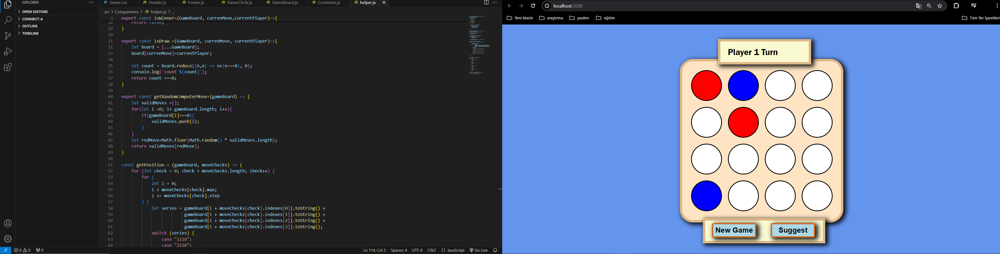

# Connect-4 Game

Bu proje, HTML, CSS ve React.js kullanılarak oluşturulmuş bir Connect-4 oyunudur.

## Özellikler

- **Kullanıcı vs Kullanıcı:** İki oyuncu sırayla hamle yapar.
- **Hamle Önerisi:** Bilgisayarın bir sonraki en iyi hamlesini önerir.

## Kurulum

Projeyi yerel makinenize klonlamak için:

```bash
git clone https://github.com/mustafaksem/connect-4.git
cd connect-4
npm install
```

## Ekran Görüntüleri

